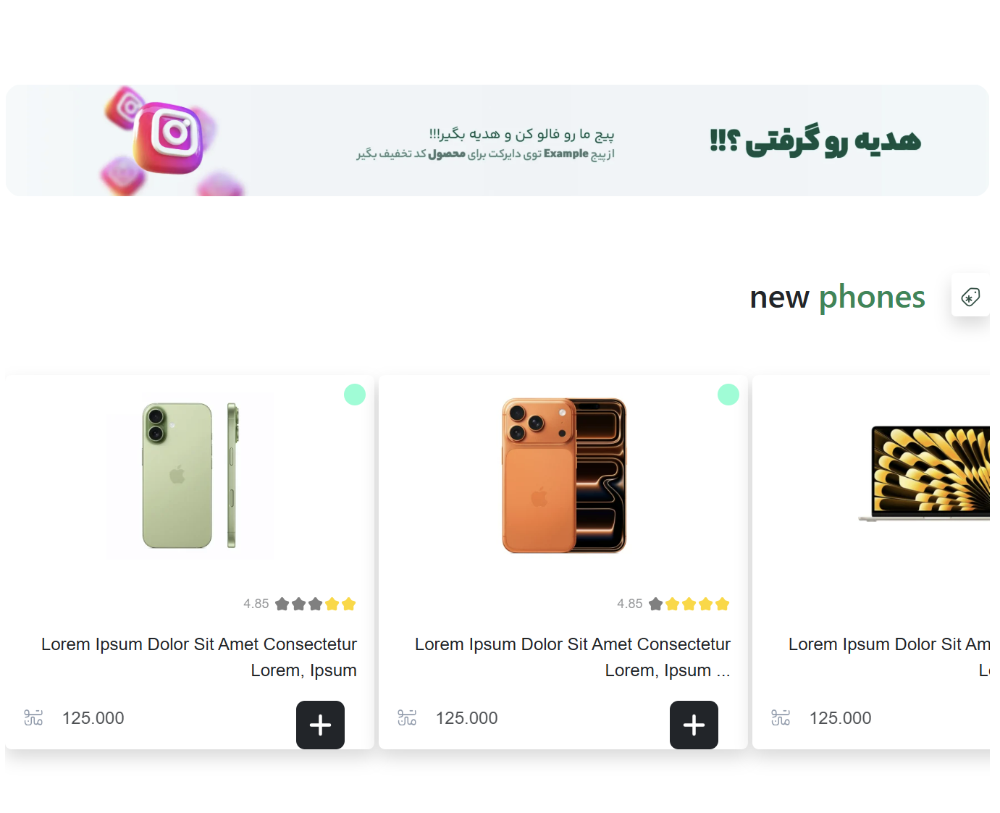

#  PoriShop1 | Premium Bootstrap Responsive Showcase

A high-end, pixel-perfect e-commerce storefront web application built using modern layout architectures and advanced front-end principles. This project serves as a comprehensive masterclass in leveraging Bootstrap v5 for building seamless, liquid-fluid user experiences across every modern device tier.

---

## 🌐 Live Deployment Overview

  <table style="border: 2px solid #0d6efd; border-radius: 12px; background: #0d1117; padding: 20px; width: 100%; max-width: 650px;">
    <tr>
      <td align="center">
         
        
        <h3 style="color: #0d6efd; margin-top: 10px; font-family: sans-serif;">Experience PoriShop1 Live</h3>
        

          Interact with the fully dynamic layout shifts, component mechanics, and optimized fluid grid system right inside your browser.
        

         
        
          
        
        &nbsp;&nbsp;
        
          
      </td>
    </tr>
  </table>

---

## ⚡ Core Features & Tech Architecture

* 📱 Ultra-Responsive Fluidity: 100% responsive architecture engineered with Bootstrap’s mobile-first Flexbox grid framework (xs, sm, md, lg, xl, xxl break-points).
* 🎨 Modern UI Components: Crafted with modular Bootstrap cards, dynamic carousels, responsive navigation layouts, interactive modals, and elegant utility-first hover states.
* ⚡ Optimized Clean Source: Semantically constructed HTML5 syntax combined with optimized structural custom CSS overlays for custom theme injection.

---

## 📸 Interface & Responsive Previews

Explore the desktop, tablet, and mobile interface alignments through the live preview captures:

<table width="100%">
  <tr>
    <td width="50%" align="center">
      
       <b>Preview 01 - Hero & Main Showcase</b>
    </td>
    <td width="50%" align="center">
      
       <b>Preview 02 - Product Catalogue Grid</b>
    </td>
  </tr>
  <tr>
    <td width="50%" align="center">
      
       <b>Preview 03 - UI Component Mechanics</b>
    </td>
    <td width="50%" align="center">
      
       <b>Preview 04 - Footer & Promotional Alignment</b>
    </td>
  </tr>
</table>
