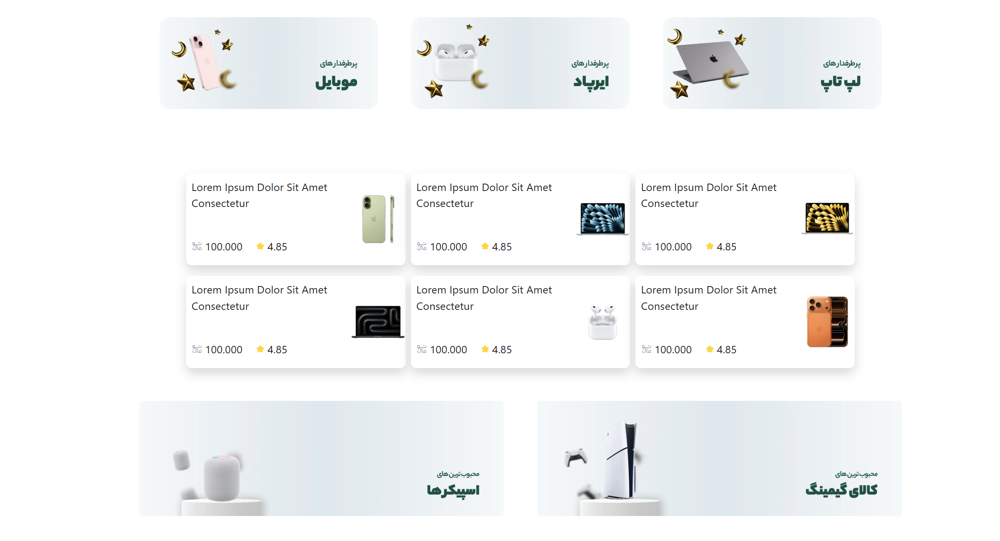
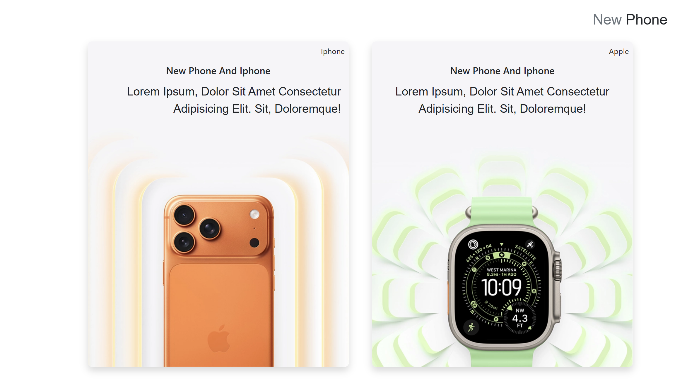
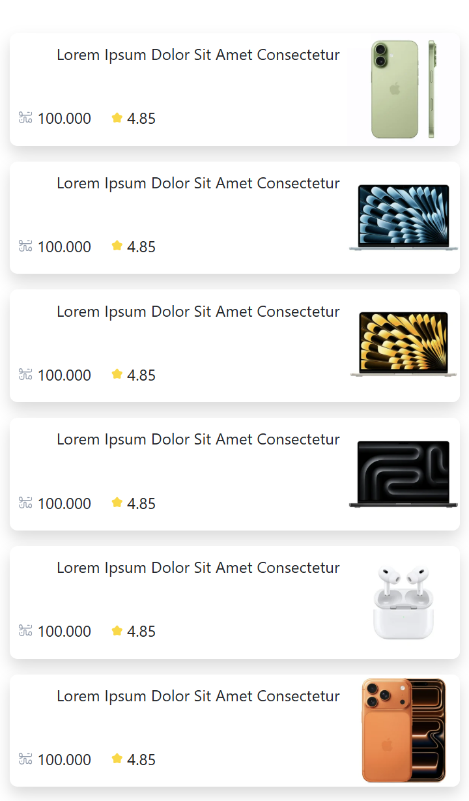

#  PoriShop1 | Modern E-Commerce Platform

A premium, next-generation storefront web application meticulously engineered for maximum visual impact and seamless liquidity across all screen dimensions.

---

## ⚡ Powerhouse Tech Stack & Capabilities

  
  
  

 

> [!🚀]
> ### 🔥 CORE ARCHITECTURE FOCUS
> This web application is exclusively built using HTML5, CSS3, and BOOTSTRAP 5. It features a 100% FULLY RESPONSIVE & MOBILE-FIRST DESIGN powered by dynamic liquid fluid grid layouts, making it absolutely flawless on any desktop, tablet, or smartphone device.

---

## 🌐 Live Storefront Demo

  

    
  

  
  ## ✨ CLICK BELOW TO EXPLORE THE LIVE APP ✨
  
  

    
  
  
  &nbsp;&nbsp;
  
  &nbsp;&nbsp;
  

---

## 📸 Responsive Layout Screenshots

<table width="100%">
  <tr>
    <td width="50%" align="center">
      
    </td>
    <td width="50%" align="center">
      
    </td>
  </tr>
  <tr>
    <td width="50%" align="center">
      
    </td>
    
  </tr>
</table>

---

## 🛠️ Built With

  
  &nbsp; &nbsp;
  
  &nbsp; &nbsp;
 

* 🌐 HTML5 – Modern Core Layout Syntax
* ⚡ Bootstrap 5 – Dynamic Grid System & Mobile-First Component Library
* 🎨 CSS3 – Advanced Layout Polish & Fine-Tuned Custom Utility Overlays

---

---
## ⚙️ Local Installation & Setup

To explore the source code locally on your machine, follow these steps:

1. Clone the repository:
`bash
   git clone [https://github.com/Pooria-dev/bootstrap_responsive_PoriShop1.git](https://github.com/Pooria-dev/bootstrap_responsive_PoriShop1.git)
